## Типовые шаблоны проектирования GoF (Gang of Four)
### Порождающие шаблоны
---
#### 1. Singleton

`src/core/config.py`
```python
@lru_cache
def get_settings() -> Settings:
    """Get cached settings instance."""
    return Settings()
```

**Объяснение**: Функция `get_settings()` с декоратором `@lru_cache` гарантирует, что объект `Settings` создаётся только один раз и переиспользуется. Это классическая реализация Singleton в Python — глобальная точка доступа к единственному экземпляру настроек приложения.

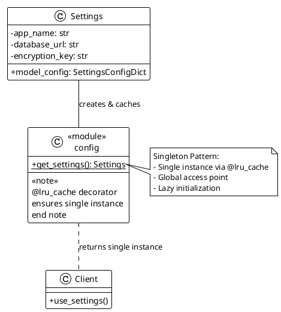


#### 2. Factory Method

`src/main.py`:
```python
def create_application() -> FastAPI:
    """Application factory."""
    settings = get_settings()
    app = FastAPI(...)
    ...
    return app
```

**Объяснение**: Функция `create_application()` является фабрикой, которая создаёт и конфигурирует экземпляр FastAPI приложения. Это позволяет отделить логику создания приложения от его использования и облегчает тестирование (можно создать тестовое приложение с другими настройками).

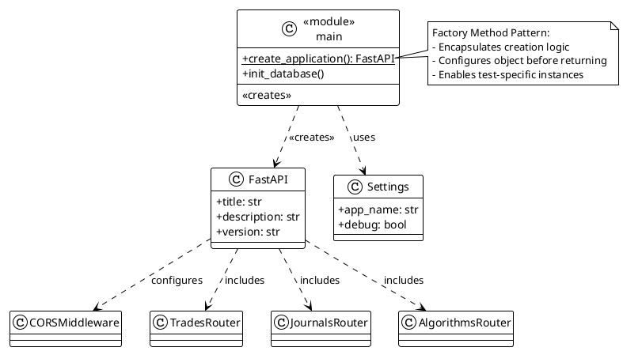


#### 3. Builder

Неявно в `TradeService.create_trade()` и `TradePosition`
```python
# В TradeService.create_trade():
trade = Trade(
    journal_id=data.journal_id,
    algorithm_id=data.algorithm_id,
    opened_at=_to_naive_utc(data.opened_at),
    ...
)

# Добавление позиций постепенно:
for pos_data in data.positions:
    position = TradePosition(...)
    trade.positions.append(position)
```

**Объяснение**: Процесс создания сложного объекта `Trade` с вложенными `TradePosition` выполняется пошагово — сначала создаётся базовая сущность, затем постепенно добавляются позиции. Это паттерн Builder, где сложный объект конструируется по частям.

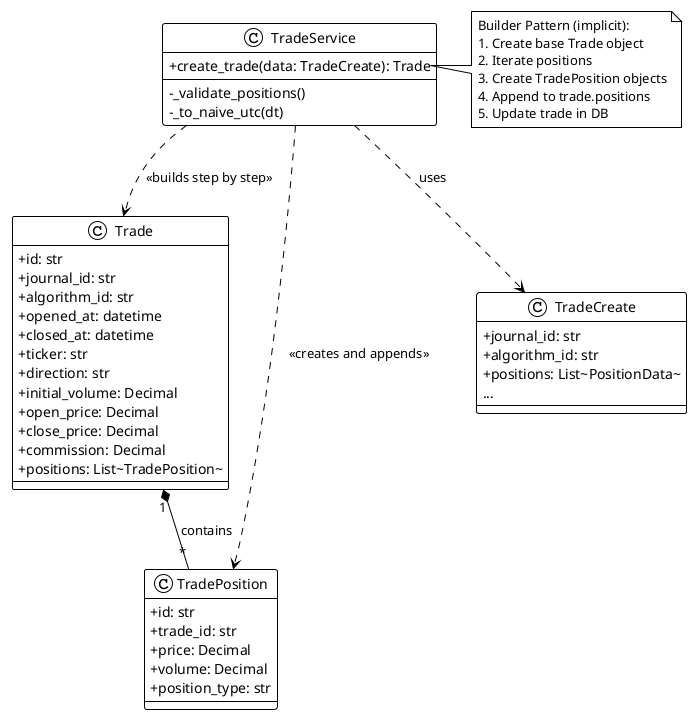


### Структурные шаблоны
---
#### 1. Repository

`src/modules/*/repository.py`
```python
class TradeRepository:
    """Repository for trade CRUD operations."""
    
    def __init__(self, session: AsyncSession) -> None:
        self.session = session

    async def get_by_id(self, trade_id: str) -> Trade | None:
        ...
    
    async def create(self, trade: Trade) -> Trade:
        ...
```

**Объяснение**: Паттерн Repository абстрагирует доступ к данным, предоставляя коллекцию-подобный интерфейс для работы с доменными объектами. Каждый модуль имеет свой Repository (`TradeRepository`, `JournalRepository`, `AlgorithmRepository`), что изолирует логику доступа к БД от бизнес-логики.

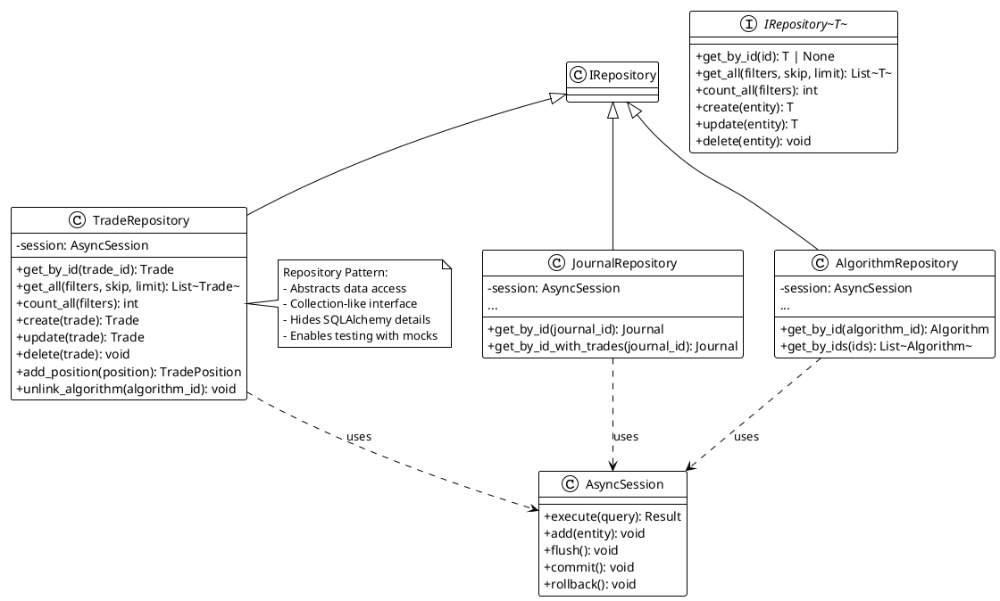


#### 2. Facade

`src/core/database.py`
```python
async def get_db_session() -> AsyncGenerator[AsyncSession, None]:
    """Dependency for getting async database sessions."""
    async with AsyncSessionLocal() as session:
        try:
            yield session
            await session.commit()
        except Exception:
            await session.rollback()
            raise
        finally:
            await session.close()
```

**Объяснение**: Функция `get_db_session()` предоставляет упрощённый интерфейс для работы с сложной подсистемой SQLAlchemy (engine, session factory, commit/rollback логика). Роутеры используют этот "фасад" через FastAPI Depends, не зная деталей реализации.

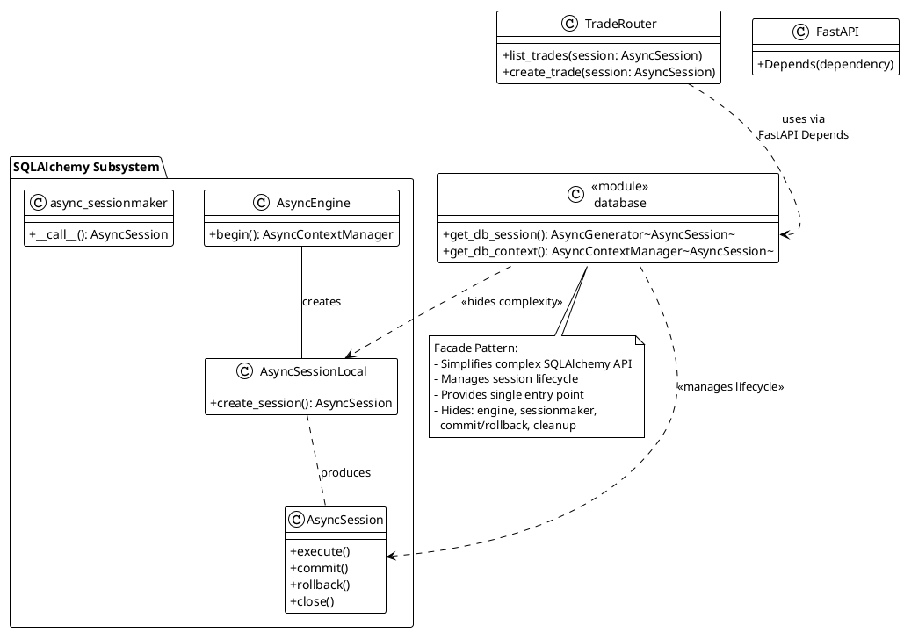


#### 3. Dependency Injection

`src/modules/*/router.py`, `src/modules/*/service.py`
```python
# В роутерах:
def get_trade_service(
    session: Annotated[AsyncSession, Depends(get_db_session)],
) -> TradeService:
    return TradeService(session)

# В сервисах:
class TradeService:
    def __init__(self, session: AsyncSession) -> None:
        self.repository = TradeRepository(session)
```

**Объяснение**: Зависимости (сессии БД, репозитории) внедряются извне через конструкторы. Это позволяет легко заменять реализации (например, моки для тестов) и уменьшает связанность между компонентами.

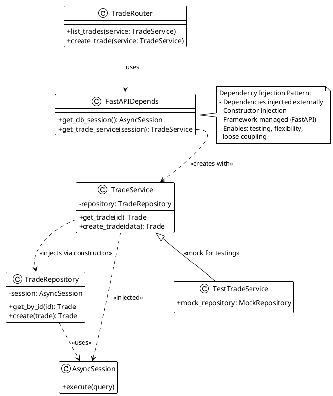


#### 4. Decorator

`src/core/encryption.py`
```python
def encrypt_value(value: str) -> str:
    """Encrypt a string value."""
    if not value:
        return value
    fernet = get_fernet()
    return fernet.encrypt(value.encode()).decode()
```

**Объяснение**: Функции `encrypt_value` и `decrypt_value` являются декораторами (обёртками) для чувствительных данных. Они добавляют функциональность шифрования к строковым значениям без изменения их интерфейса. Также паттерн применяется в `_to_naive_utc()` — обёртка для конвертации datetime.

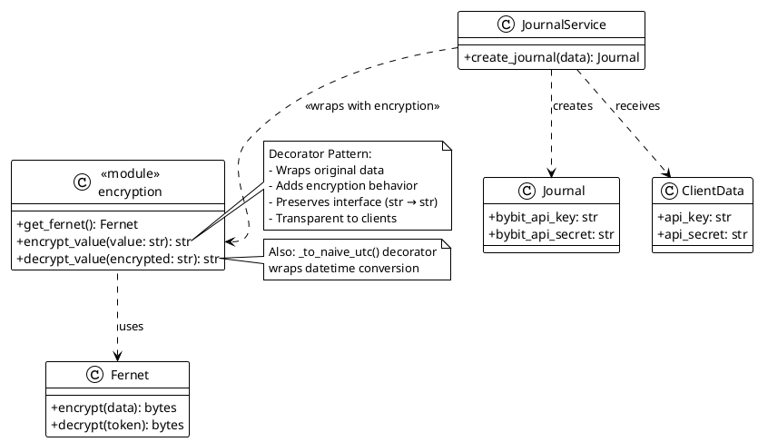


#### 5. Adapter

`src/modules/trades/router.py`
```python
def trade_to_response(trade) -> TradeResponse:
    """Convert trade model to response schema."""
    return TradeResponse(
        id=trade.id,
        journal_id=trade.journal_id,
        ...
        pnl=trade.calculate_pnl(),
        current_volume=trade.get_current_volume(),
    )
```

**Объяснение**: Функции `trade_to_response` и `trade_to_detail_response` адаптируют внутренние модели SQLAlchemy (Trade) к внешнему API формату (Pydantic схемы). Это преобразование между несовместимыми интерфейсами.

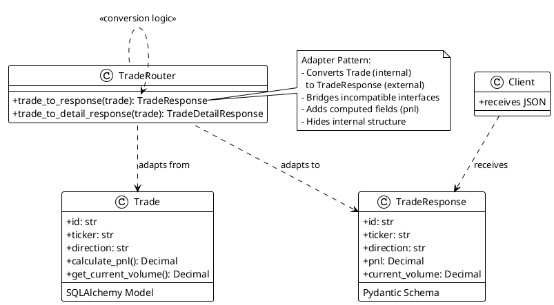


### Поведенческие шаблоны
---
#### 1. Strategy

`src/modules/trades/models.py` — `calculate_pnl()`
```python
def calculate_pnl(self) -> Decimal:
    """Calculate profit/loss for this trade."""
    if self.direction == "long":
        gross_pnl = (self.close_price - self.open_price) * self.initial_volume
    else:  # short
        gross_pnl = (self.open_price - self.close_price) * self.initial_volume
    return gross_pnl - self.commission
```

**Объяснение**: Разные алгоритмы расчёта PnL для long и short позиций выбираются во время выполнения на основе значения `direction`. Это паттерн Strategy — инкапсуляция семейства алгоритмов.

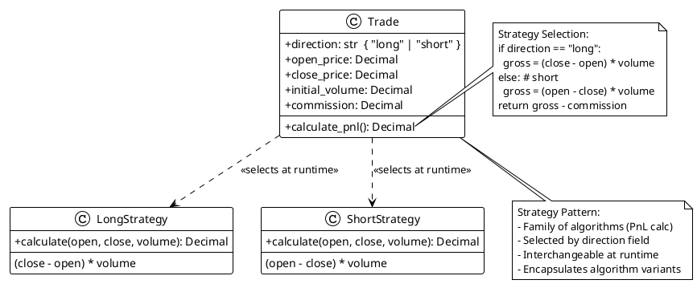


#### 2. Command

`src/modules/trades/schemas.py`
```python
class TradeCreate(BaseModel):
    """Schema for creating a trade."""
    journal_id: str
    algorithm_id: str | None
    opened_at: datetime
    ...

class TradeUpdate(BaseModel):
    """Schema for updating a trade."""
    opened_at: datetime | None = None
    ...
```

**Объяснение**: Pydantic схемы (`TradeCreate`, `TradeUpdate`, `AddPositionRequest`) инкапсулируют запросы как объекты. Они передаются в сервисы как "команды" для выполнения операций, отделяя данные запроса от их обработки.

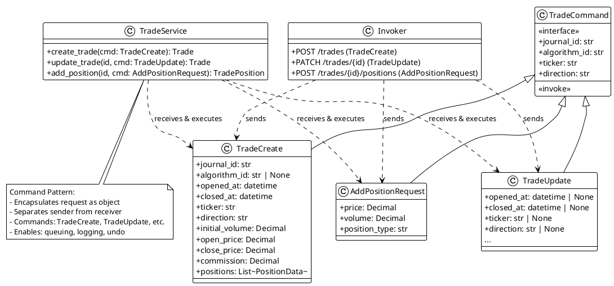


#### 3. Template Method

`src/modules/*/repository.py`
```python
class TradeRepository:
    async def get_by_id(self, trade_id: str) -> Trade | None:
        """Get trade by ID with positions."""
        result = await self.session.execute(
            select(Trade)
            .where(Trade.id == trade_id)
            .options(selectinload(Trade.positions))
        )
        return result.scalar_one_or_none()

    async def create(self, trade: Trade) -> Trade:
        """Create a new trade."""
        self.session.add(trade)
        await self.session.flush()
        await self.session.refresh(trade)
        return trade
```

**Объяснение**: Все Repository классы следуют общему шаблону: `get_by_id`, `get_all`, `create`, `update`, `delete`. Это единый алгоритм (шаблон), который реализуется с вариациями для каждой сущности.

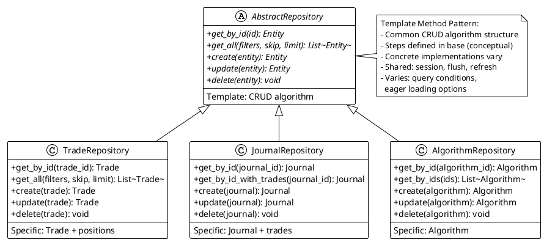


#### 4. Iterator

`src/modules/trades/models.py`
```python
def get_total_added_volume(self) -> Decimal:
    """Get total volume added via positions."""
    total = Decimal("0")
    for pos in self.positions:  # Итерация по коллекции
        if pos.position_type == "add":
            total += pos.volume
    return total
```

**Объяснение**: Python коллекции (`list[TradePosition]`) предоставляют итератор для последовательного доступа к элементам. Методы `get_total_added_volume`, `get_total_reduced_volume` используют этот паттерн.

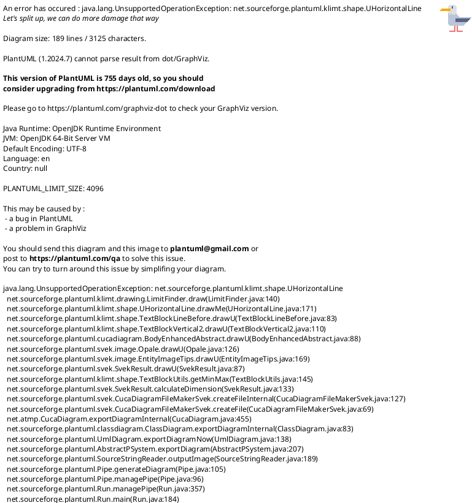


#### 5. Observer

```python
# В Trade:
positions: Mapped[list[TradePosition]] = relationship(
    "TradePosition",
    back_populates="trade",
    cascade="all, delete-orphan",  # Автоматическое обновление
    ...
)
```

**Объяснение**: SQLAlchemy ORM реализует паттерн Observer — при изменении родительского объекта (`Trade`) автоматически обновляются связанные объекты (`TradePosition`). `cascade="all, delete-orphan"` обеспечивает автоматическую синхронизацию.

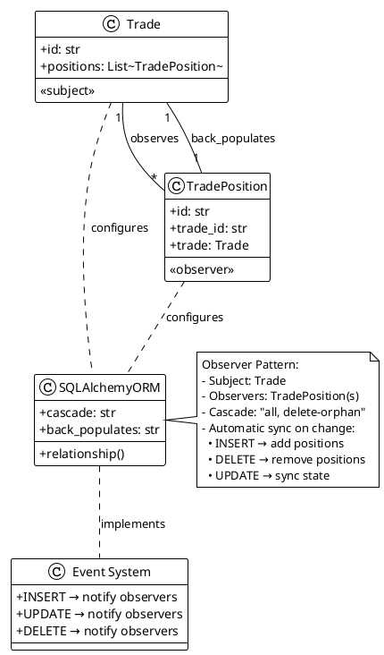


#### 6. Mediator

```python
class TradeService:
    def __init__(self, session: AsyncSession) -> None:
        self.repository = TradeRepository(session)
    
    async def create_trade(self, data: TradeCreate) -> Trade:
        # Координация создания trade и positions
        trade = await self.repository.create(trade)
        for pos_data in data.positions:
            position = TradePosition(...)
            trade.positions.append(position)
        await self.repository.update(trade)
        return trade
```

**Объяснение**: Service слой выступает посредником между роутерами (контроллерами) и репозиториями, координируя сложные операции.

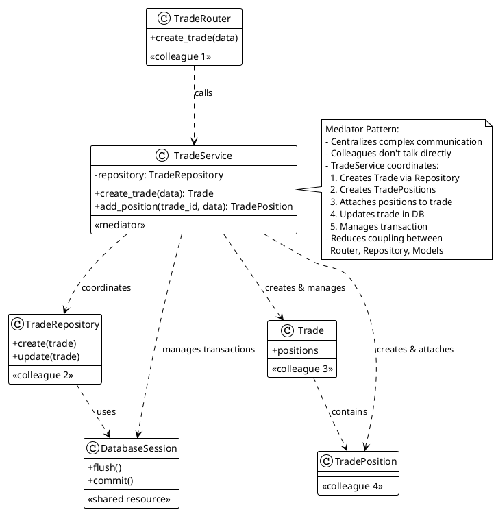


## GRASP Паттерны

### Роли классов
---

| Роль               | Класс                         | Пояснение                                                                     |
| ------------------ | ----------------------------- | ----------------------------------------------------------------------------- |
| Information Expert | Trade                         | Содержит данные о сделке и методы расчёта (calculate_pnl, get_current_volume) |
| Creator            | TradeService                  | Создаёт Trade и TradePosition, знает правила валидации                        |
| Controller         | TradeRouter / FastAPI routers | Принимают запросы и делегируют выполнение сервисам                            |
| Pure Fabrication   | TradeRepository               | Искусственный класс для инкапсуляции доступа к БД, не из доменной области     |
| Coordinator        | TradeService                  | Координирует работу Repository и Models для выполнения use cases              |

### Принципы разработки
---

| Принцип                           | Реализация                                       | Пояснение                                                          |
| --------------------------------- | ------------------------------------------------ | ------------------------------------------------------------------ |
| Low Coupling (Низкая связанность) | Модули не импортируют напрямую модели друг друга | trades модуль не зависит от деталей algorithms, только через FK    |
| High Cohesion (Высокая связность) | Каждый модуль имеет чёткую ответственность       | trades: сделки, journals: журналы, algorithms: алгоритмы           |
| Indirection (Косвенность)         | Repository слой между Service и БД               | 	Позволяет заменить SQLAlchemy на другую ORM без изменения Service |

### Свойства программы
---

| Свойство                                   | Реализация                              | Пояснение                                                                                                            |
| ------------------------------------------ | --------------------------------------- | -------------------------------------------------------------------------------------------------------------------- |
| Protected Variations (Защита от изменений) | Зависимости внедряются через интерфейсы | AsyncSession передаётся в конструкторы — можно заменить на мок для тестов; get_db_session изолирован в core/database |

